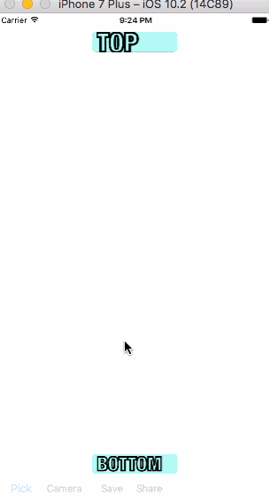

# MemeMaker
iOS application to make memes using locally-stored or camera photos. 

User will be able to either take a photo, or select a photo from the gallery. Using the selected photo, user can input text on the top or bottom or the image in order to create a meme.

This application is a project, part of a course on Udacity called UIKit Fundamentals for iOS development.

